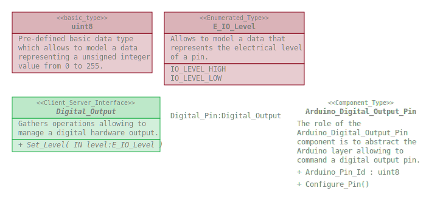
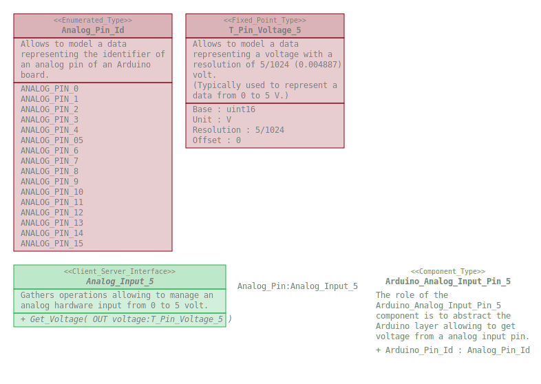

# Arduino_Pins

This repository defines a package gathering software elements allowing to
abstract the Arduino plateform for hardware I/O management.

## Content

### Arduino_Digital_Output_Pin

#### Configuration_Parameters

| Name  | Type | Description |
|:----|:----|:----|
| Arduino_Pin_Id | uint8 | Identifier of the digital pin of the Arduino board. From 0 to 69. |

#### OS_Operations

| Name  | Description |
|:----|:----|
| Configure_Pin | Allows to configure the pin of the Arduino board (identified by Arduino_Pin_Id) as an output pin. This operation shall be called once at initialization, before setting the level of the pin. |

### Arduino_Analog_Input_Pin_5

#### Configuration_Parameters

| Name  | Type | Description |
|:----|:----|:----|
| Arduino_Pin_Id | Analog_Pin_Id | Identifier of the analog  pin of the Arduino board. |

## Dependencies

* Hardware_IO_Interfaces : https://github.com/SanteyneEmbeddedSystems/Hardware_IO_Interfaces/releases/tag/v2.0.0

## Use

### With the Arduino IDE

This repository shall be clone within the _libraries_ folder of the _Arduino
sketchbook folder_.