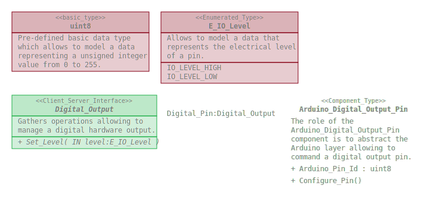
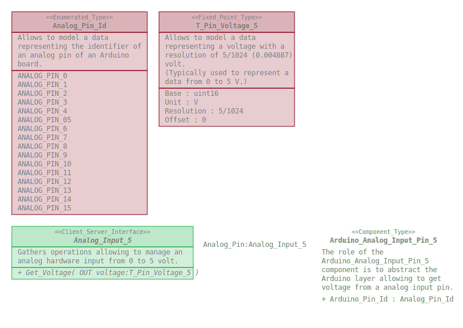

# Arduino_Pins

This repository defines a package gathering software elements allowing to
abstract the Arduino plateform for hardware I/O management.

## Content

### Arduino_Digital_Output_Pin

### Arduino_Analog_Input_Pin_5

## Dependencies

* Hardware_IO_Interfaces : https://github.com/SanteyneEmbeddedSystems/Hardware_IO_Interfaces/releases/tag/v2.0.0

## Use

### With the Arduino IDE

This repository shall be clone within the _libraries_ folder of the _Arduino
sketchbook folder_.